### Codegraph cục bộ

- Nguồn: 125 tệp mã; 540 liên kết import cục bộ.
- Hiển thị: 20/540 liên kết theo thứ tự ổn định.
- Phạm vi: chỉ import resolve được trong project; package ngoài không được đưa vào context.

```mermaid
graph TD
  n_696e746567726174696f6e5f746573742f6c756f6e675f6461795f64755f746573742e64617274["integration_test/luong_day_du_test.dart"] --> n_6c69622f6170702f6170702e64617274["lib/app/app.dart"]
  n_696e746567726174696f6e5f746573742f6c756f6e675f6461795f64755f746573742e64617274["integration_test/luong_day_du_test.dart"] --> n_6c69622f636f72652f70726f7669646572732f64617461626173655f70726f76696465722e64617274["lib/core/providers/database_provider.dart"]
  n_696e746567726174696f6e5f746573742f6c756f6e675f6461795f64755f746573742e64617274["integration_test/luong_day_du_test.dart"] --> n_6c69622f636f72652f70726f7669646572732f73657373696f6e5f70726f76696465722e64617274["lib/core/providers/session_provider.dart"]
  n_696e746567726174696f6e5f746573742f6c756f6e675f6461795f64755f746573742e64617274["integration_test/luong_day_du_test.dart"] --> n_6c69622f636f72652f776964676574732f7461736b5f636172642e64617274["lib/core/widgets/task_card.dart"]
  n_696e746567726174696f6e5f746573742f6c756f6e675f6461795f64755f746573742e64617274["integration_test/luong_day_du_test.dart"] --> n_6c69622f646174612f6c6f63616c2f64617461626173652e64617274["lib/data/local/database.dart"]
  n_696e746567726174696f6e5f746573742f6c756f6e675f6461795f64755f746573742e64617274["integration_test/luong_day_du_test.dart"] --> n_6c69622f646174612f6c6f63616c2f77616c6c65745f64616f2e64617274["lib/data/local/wallet_dao.dart"]
  n_696e746567726174696f6e5f746573742f6c756f6e675f6461795f64755f746573742e64617274["integration_test/luong_day_du_test.dart"] --> n_6c69622f646f6d61696e2f656e7469746965732f656e756d732e64617274["lib/domain/entities/enums.dart"]
  n_696e746567726174696f6e5f746573742f6c756f6e675f6461795f64755f746573742e64617274["integration_test/luong_day_du_test.dart"] --> n_6c69622f646f6d61696e2f656e7469746965732f6a61725f6465662e64617274["lib/domain/entities/jar_def.dart"]
  n_6c69622f6170702f6170702e64617274["lib/app/app.dart"] --> n_6c69622f6170702f726f757465722e64617274["lib/app/router.dart"]
  n_6c69622f6170702f6170702e64617274["lib/app/app.dart"] --> n_6c69622f636f72652f646961676e6f73746963732f636875705f6d616e5f68696e682e64617274["lib/core/diagnostics/chup_man_hinh.dart"]
  n_6c69622f6170702f6170702e64617274["lib/app/app.dart"] --> n_6c69622f636f72652f70726f7669646572732f64617461626173655f70726f76696465722e64617274["lib/core/providers/database_provider.dart"]
  n_6c69622f6170702f6170702e64617274["lib/app/app.dart"] --> n_6c69622f636f72652f70726f7669646572732f73657373696f6e5f70726f76696465722e64617274["lib/core/providers/session_provider.dart"]
  n_6c69622f6170702f6170702e64617274["lib/app/app.dart"] --> n_6c69622f636f72652f70726f7669646572732f7468656d655f6d6f64655f70726f76696465722e64617274["lib/core/providers/theme_mode_provider.dart"]
  n_6c69622f6170702f6170702e64617274["lib/app/app.dart"] --> n_6c69622f636f72652f7468656d652f6170705f7468656d652e64617274["lib/core/theme/app_theme.dart"]
  n_6c69622f6170702f6170702e64617274["lib/app/app.dart"] --> n_6c69622f636f72652f7468656d652f6170705f7479706f6772617068792e64617274["lib/core/theme/app_typography.dart"]
  n_6c69622f6170702f726f757465722e64617274["lib/app/router.dart"] --> n_6c69622f636f72652f70726f7669646572732f73657373696f6e5f70726f76696465722e64617274["lib/core/providers/session_provider.dart"]
  n_6c69622f6170702f726f757465722e64617274["lib/app/router.dart"] --> n_6c69622f636f72652f776964676574732f726573706f6e736976655f73636166666f6c642e64617274["lib/core/widgets/responsive_scaffold.dart"]
  n_6c69622f6170702f726f757465722e64617274["lib/app/router.dart"] --> n_6c69622f66656174757265732f6368696c645f686f6d652f6368696c645f686f6d655f73637265656e2e64617274["lib/features/child_home/child_home_screen.dart"]
  n_6c69622f6170702f726f757465722e64617274["lib/app/router.dart"] --> n_6c69622f66656174757265732f6f6e626f617264696e672f6f6e626f617264696e675f73637265656e2e64617274["lib/features/onboarding/onboarding_screen.dart"]
  n_6c69622f6170702f726f757465722e64617274["lib/app/router.dart"] --> n_6c69622f66656174757265732f706172656e745f686f6d652f706172656e745f686f6d655f73637265656e2e64617274["lib/features/parent_home/parent_home_screen.dart"]
  more["… 520 liên kết đã lược bỏ"]
```

